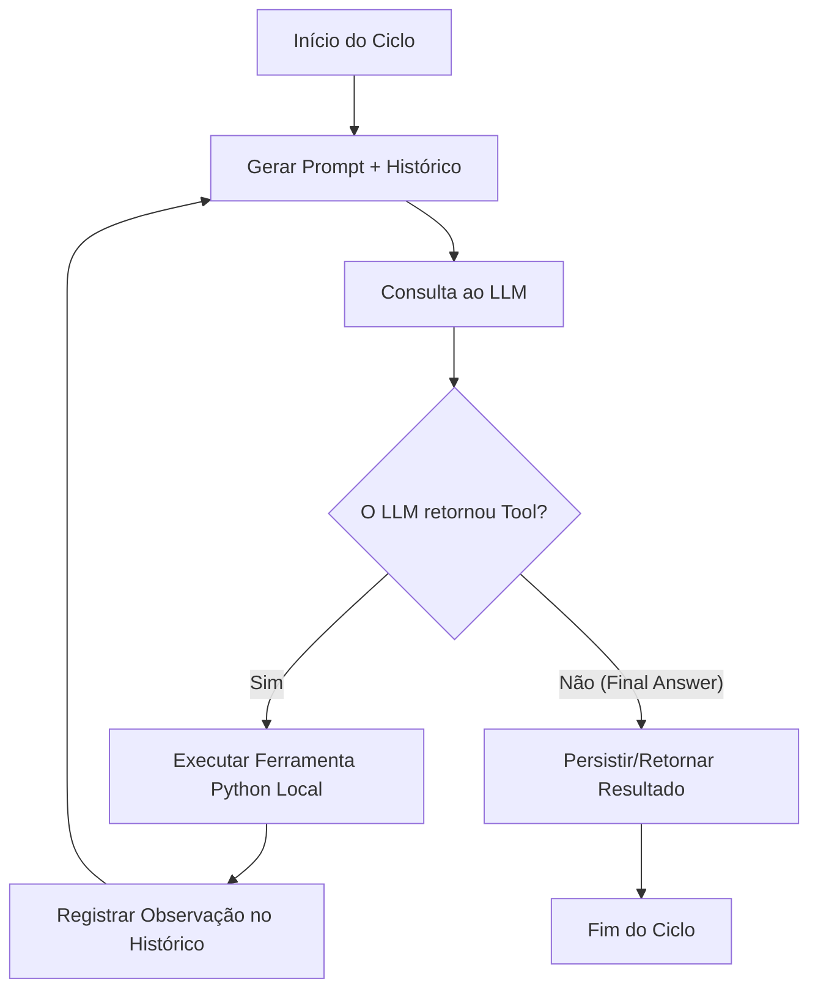

# Guia Técnico: Arquitetura de Subagentes Inteligentes (Omni Core V2)

Este guia descreve a arquitetura de subagentes baseados em LLM (Large Language Model) implementada no Omni Core V2, permitindo que processos cognitivos complexos executem loops de raciocínio lógico (CoT), invoquem ferramentas locais de sistema/banco de dados e corrijam seus próprios erros em tempo real.

---

## 🏗️ 1. O Modelo ReAct / CoT (Thought-Tool-Observation)

Diferente de requisições simples para modelos de IA que retornam textos genéricos, um **subagente autônomo** opera em um loop de raciocínio interativo:



O subagente é alimentado com um prompt do sistema que descreve suas regras e restrições, uma descrição da tarefa atual e o metadados de todas as ferramentas locais registradas a que ele tem acesso.

---

## 🛠️ 2. Como Criar e Registrar Ferramentas (@tool)

Qualquer subagente que herde de `SubAgentBase` pode registrar automaticamente métodos locais como ferramentas disponíveis para a IA simplesmente decorando o método com o decorador `@tool` de `core.subagent_base`.

### Exemplo de Código:

```python
from core.subagent_base import SubAgentBase, tool
from core.worker_base import WorkerResult

class MeuNovoSubAgente(SubAgentBase):
    def __init__(self, reward_store=None, config=None):
        super().__init__(name="MeuNovoWorker", reward_store=reward_store, config=config)

    @tool
    def consultar_status_transmissao(self) -> str:
        """
        Consulta as instâncias ativas do encoder BUTT na máquina.
        Retorna uma string detalhando o status de conexão.
        """
        # ... lógica de sistema
        return "BUTT: 3 instâncias ativas, stream OK."

    def run_cycle(self) -> WorkerResult:
        task = "Audite a transmissão atual e envie alertas se houver falhas."
        system_prompt = "Você é um auditor de stream. Use 'consultar_status_transmissao' para verificar a saúde."
        
        # Executa o loop de raciocínio de até 5 passos
        res = self.run_agent_loop(task, system_prompt, max_steps=5)
        
        if res.get("status") == "success":
            return WorkerResult(status="success", score=5, metadata={"result": res.get("result")})
        return WorkerResult(status="failed", score=-5, violations=["Falha no agente"])
```

> [!NOTE]
> A docstring do método decorado com `@tool` é de suma importância, pois ela é serializada em JSON e enviada ao LLM para que a IA entenda **quando** e **como** usar a ferramenta.

---

## 🔌 3. Configurações de Modelos e Fallback (Gemini ⇄ Ollama)

A infraestrutura de subagentes suporta fallback automático entre a API do Google Gemini e uma instância local do Ollama (`qwen2.5:7b` ou similar).

As configurações de preferência e endpoints são lidas de `config/settings.json`:

```json
{
  "workers": {
    "CuradoriaWorker": {
      "model_preference": "gemini",
      "ollama_url": "http://localhost:11434/api/generate",
      "ollama_model": "qwen2.5:7b"
    }
  }
}
```

*   **`model_preference`**: `"gemini"` (usa a API oficial do Gemini de alta performance) ou `"ollama"` (executa chamadas locais livres de custos e internet).
*   **Fallback**: Se a chamada ao Gemini falhar devido a limites de requisição (Rate Limits) ou falta de internet, o subagente automaticamente desvia a chamada para a API local do Ollama para garantir resiliência 24/7.

---

## 📚 4. Subagentes Refatorados

### 1. CuratorSubAgent (`CuradoriaWorker`)
*   **Função**: Analisa o acervo, realiza auditoria acústica e classifica humor (Mood) das músicas.
*   **Ferramentas**: `auditar_arquivo_acustica()`, `salvar_curadoria()`, `enviar_quarentena()`.

### 2. PlaylistSubAgent (`PlaylistWorker`)
*   **Função**: Gera a programação diária adaptada ao clima de Natal, checa conflitos e auto-corrige violações.
*   **Ferramentas**: `obter_clima_natal()`, `listar_musicas_candidatas()`, `auditar_programacao()`, `gravar_playlist()`.

### 3. ARScoutSubAgent (`DownloaderWorker`)
*   **Função**: Descobre faixas relevantes usando recomendações algorítmicas, executa o download físico seguro do YouTube e cataloga os metadados de forma limpa.
*   **Ferramentas**: `obter_recomendacoes_acervo()`, `buscar_e_baixar_faixa()`, `cadastrar_musica()`.

### 4. ReporterSubAgent (`DailyReportWorker`)
*   **Função**: Consolida logs e o histórico de pontuações de todos os workers e envia um relatório executivo rico em observações pelo WhatsApp.
*   **Ferramentas**: `obter_resumo_performance()`, `enviar_relatorio_gerencial()`.
